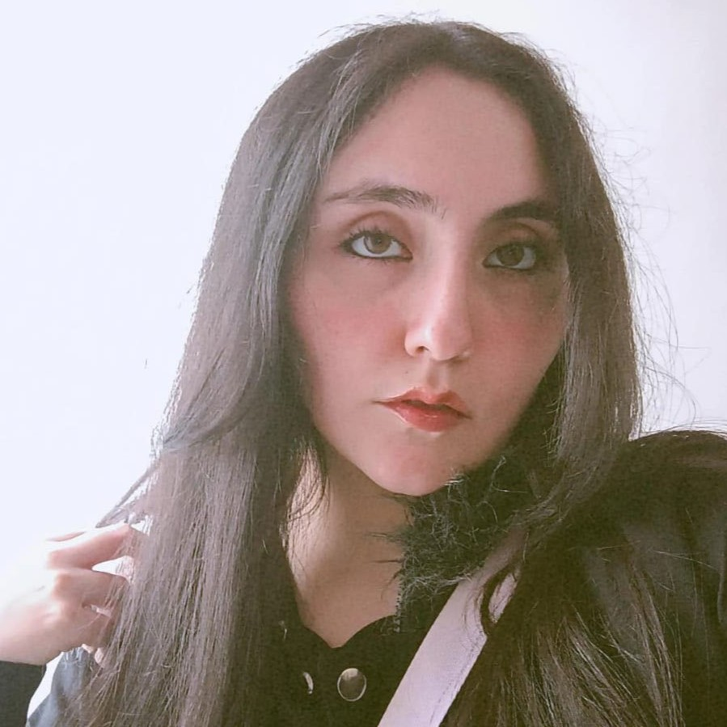

# Nova-Craft-Game
Repositorio para el desarrollo de la Etapa 1 de Programación para Videojuegos

---
## Daniela Gutiérrez

**Rol:** 3D artist / Tecnical Artist 
**Apoyo en:** Producer
**Ubicación:** Bogotá / Colombia
### Perfil 
Soy estudiante de Ingeniería Multimedia interesada en la ilustración y el diseño de personajes. Tengo conocimientos en herramientas como Krita, Photoshop, Illustrator, Inkscape, MediBang Paint, Premiere Pro y Reaper. También cuento con experiencia en el desarrollo de proyectos multimedia y videojuegos utilizando Unity y Blender.